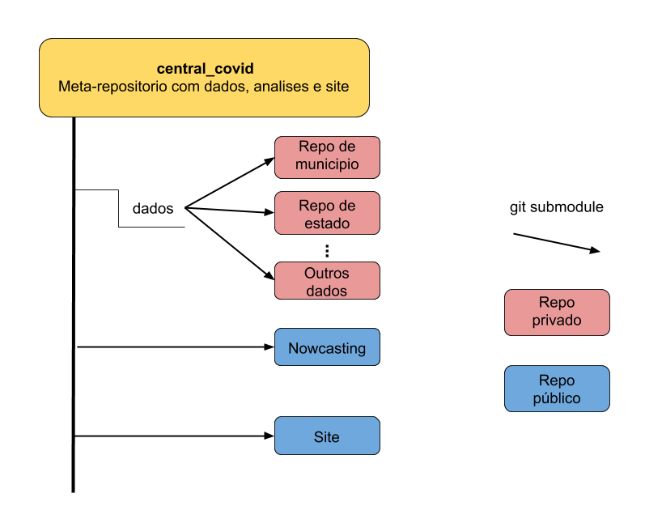

# Meta repo para dados e analises

Repo centralizado para organizar os repos de análise e de dados numa estrutura padronizada.

```bash
git clone git@github.com:covid19br/central_covid.git
cd central_covid
git submodule update --init
```


# Estrutura

O repositório central covid funciona como um agregador de todos os repositórios relacionados às análises e divulgação do Observatório covid19. O uso de um meta-repo e git submodules permite controlar o acesso a dados sigilosos, mas disponibilizar todos os códigos e dados processados publicamente.



## Dados

Os repositórios sigilosos devem ficar dentro da pasta dados, e pode ser ignorados pelos usuários sem acesso aos dados sigilosos. 

Para acrescentar um conjunto de dados novo, basta adicionar o repositório novo na pasta de dados:

```
cd dados
git submodule add URL_do_repo_novo
```

Depois é necessário dar um commit no meta-repo para incluir esse novo sub-repositório no histórico.


## Fazendo mudanças nos sub-repositório e no meta-repositório

O primeiro pull dos sub-repositórios coloca esses repositórios num estado "detached HEAD", e mudanças feitas nesse estado **NÃO SÃO INCLUIDAS NO HISTÓRICO DO GIT**. Para fazer mudanças, é necessário entrar em algum branch. Para isso, basta, entrar no repositório a ser modificado e dar um ```checkout``` no branch adequado:

```
cd nowcasting
git checkout master
```

Também é possível usar o comando ```foreach``` para mudar o branch, ou mesmo criar um um branch em todos os sub-repositórios simultaneamente.

```
git submodule foreach 'git checkout master'
```


Após escolher o branch adequado, todo o trabalho dentro das pastas site, nowcasting ou nos repos de dados deve ser incluída nesses repos normalmente, com ```git add arquivo_modificado``` e ```git commit``` utilizados dentro das pastas dos sub-repositórios. 
Após mudanças nesses sub-repositórios, é necessário atualizar no meta-repositório central_covid qual é o commit mais recente dos sub-repositórios. Isso é feito com um ```git add``` e ```git commit``` a partir do meta-repositório central.

## Trazendo mudanças recentes do servidor

É possível atualizar simultaneamente o meta-repositório e todos os sub-repositórios com:

```bash
git pull --recurse-submodules
```

## Para saber mais sobre submodules

Para uma introdução nada introdutória a git submodules, veja [https://git-scm.com/book/en/v2/Git-Tools-Submodules](https://git-scm.com/book/en/v2/Git-Tools-Submodules)